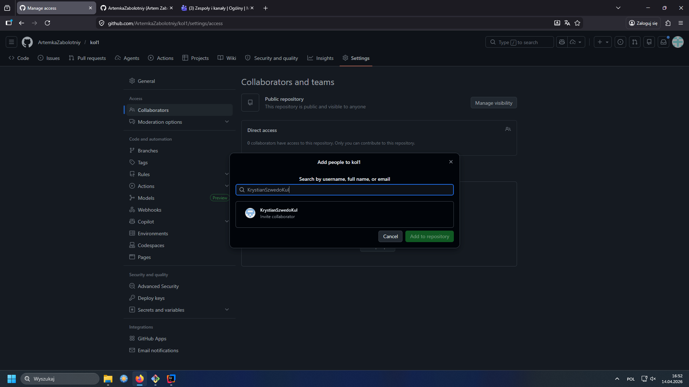
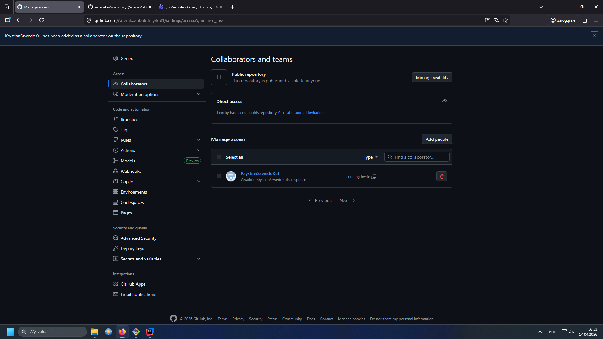
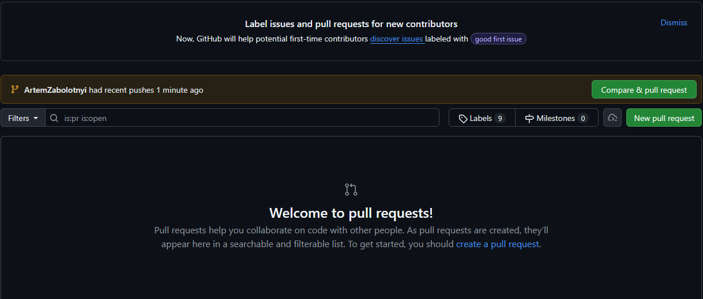
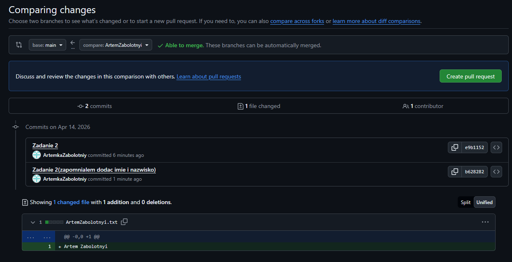
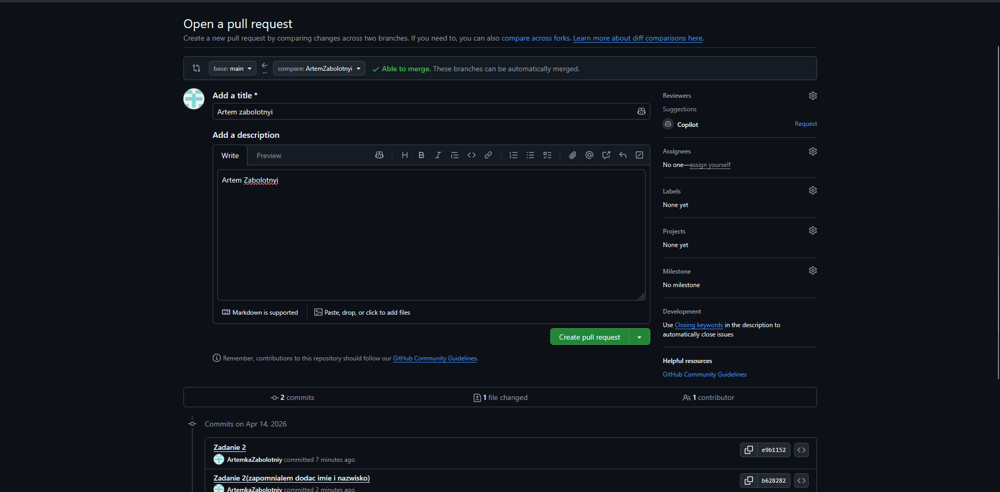
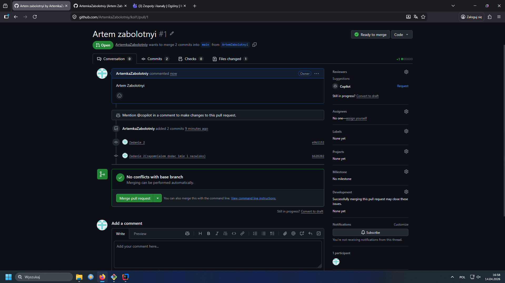
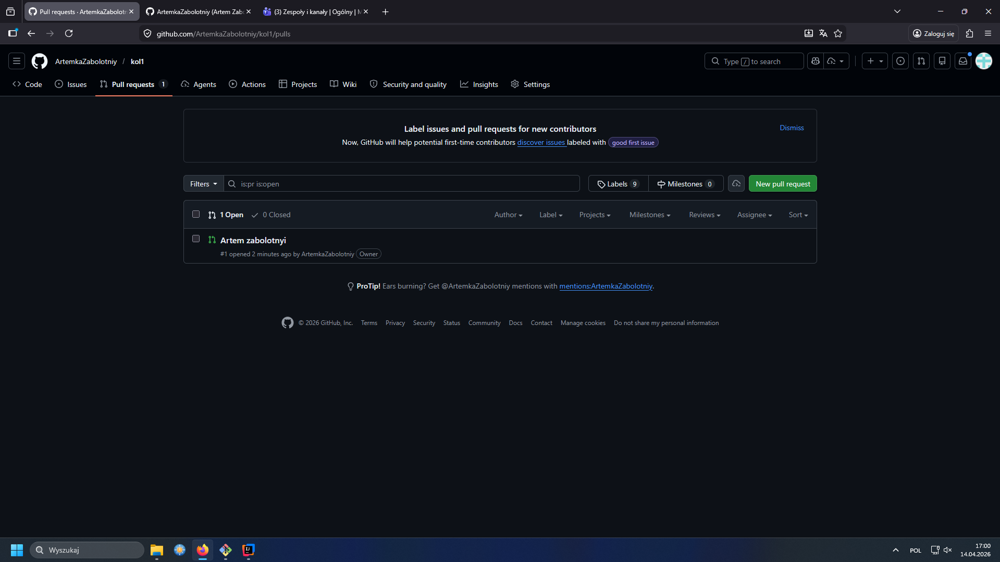

# kol1
## Zadanie 1
* echo "# kol1" >> README.md
* git init
* git add README.md
* git commit -m "first commit"
*  git branch -M main
* git remote add origin https://github.com/ArtemkaZabolotniy/kol1.git
*  git push -u origin main

## Zadanie 2
* git checkout -b ArtemZabolotnyi
* git branch
* git add ArtemZabolotnyi.txt
* git commit -m "Zadanie 2"
* git push
## Zadanie 3

